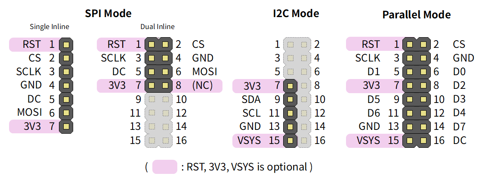

# LcdTap

A library and its example design that receives LCD controller commands (via SPI or I2C)
and outputs the framebuffer as a DVI-D signal.

## Features

- Receives LCD controller commands and reconstructs images into the framebuffer
- Outputs framebuffer contents as DVI-D signal (using Pico-DVI)
- Programmable screen sizes (up to 480x320 supported on Pico2)
- Command Dump: Captures and displays LCD control commands
- OSD Menu: Configure settings at runtime via on-screen display
- Serial Interface: Remote configuration and framebuffer readout over USB CDC
- Supported Controllers: ST7789, ILI9341, ILI9488, SSD1306, SSD1309, SSD1331, and some variants
- Supported Interfaces: SPI (4-line, 3-line), I2C, Parallel
- Supported Pixel Formats: Monochrome, RGB111, RGB332, RGB444, RGB565, RGB666

## Example Design

### LcdTap-Pico2 Universal (Recommended)

Supports multiple LCD controllers and interfaces, selectable at runtime via an OSD menu.

See [pico2_universal](example/pico2_universal/README.md) for build
instructions, pin assignment, and configuration details.

### LcdTap-Pico2 for ST7789, ILI9341, ILI9488, etc.

See [pico2_st7789](example/pico2_st7789/README.md) for build
instructions, pin assignment, and configuration details.

### LcdTap-Pico2 for SSD1306, SSD1309, etc.

See [pico2_ssd1306](example/pico2_ssd1306/README.md) for build
instructions, pin assignment, and configuration details.

## Video

https://github.com/user-attachments/assets/6f17d5dc-84d3-4a2a-a3ea-fca37591515f

## Recommended Header Pinout / Cable Color

|Pin|Parallel Mode|SPI Mode|I2C Mode|Recommended Color|
|:--:|:--:|:--:|:--:|:--:|
|1|RST|RST||Violet or Brown|
|2|CS|CS||Yellow|
|3|WEN|SCLK||White|
|4|GND|GND||Black|
|5|D1|DC||Blue|
|6|D0|MOSI||Green|
|7|3V3|3V3|3V3|Red|
|8|D2||||
|9|D5||SDA|Green|
|10|D3||||
|11|D6||SCL|White|
|12|D4||||
|13|GND||GND|Black|
|14|D7||||
|15|VSYS||VSYS|Orange|
|16|DC||||

## Applicable Examples

- [M5Stack CoreS3](./CFG_M5STACK_CORES3.md)
- [PicoSystem](./CFG_PICOSYSTEM.md)
- [Arduboy](./CFG_ARDUBOY.md)
- [TinyJoyPad](./CFG_TINYJOYPAD.md)
- [Thumby](./CFG_THUMBY.md)
- [Geiger-Muller Counter SOEKS-01M](./CFG_SOEKS01M.md)
- [USB Digital Tester J7-c](./CFG_J7C.md)

## License

MIT License — see [LICENSE](LICENSE).
