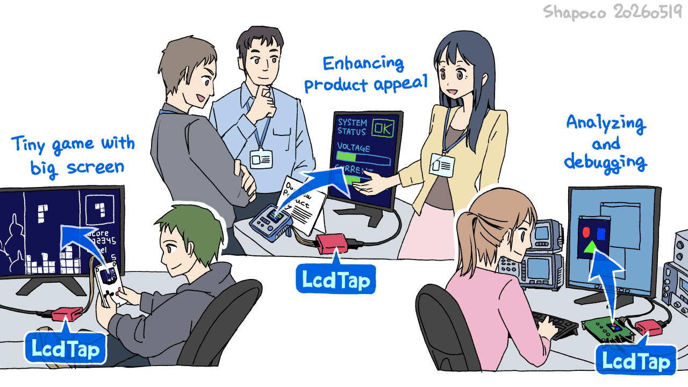
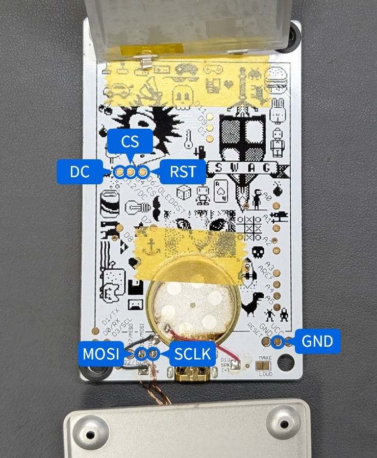

# LcdTap

A library and example that receives LCD controller commands (via SPI or I2C)
and outputs the framebuffer as a DVI-D signal.

## Example Design

### Universal

Supports multiple LCD controllers and interfaces, selectable at runtime via an OSD menu.

See [pico2_universal](example/pico2_universal/README.md) for build
instructions, pin assignment, and configuration details.

### for ST7789, ILI9341, ILI9488, etc.

See [pico2_st7789](example/pico2_st7789/README.md) for build
instructions, pin assignment, and configuration details.

### for SSD1306, SSD1309, etc.

See [pico2_ssd1306](example/pico2_ssd1306/README.md) for build
instructions, pin assignment, and configuration details.

## Supported Controllers

| Controller | Display Type | Default Interface Format | Drawing Commands |
|:-----------|:------------|:------------------------|:----------------|
| ST7789     | Color TFT   | RGB565_BE (COLMOD 0x3A selectable) | — |
| SSD1306    | Mono OLED   | GRAY1_VPACK8_H2L        | — |
| SSD1331    | Color OLED  | RGB332 (SETREMAP selectable) | DRAWLINE, DRAWRECT, COPY, DIMWINDOW, CLEARWINDOW |

### Supported Interface Pixel Formats

| Enum Value | Bits/pixel | Description |
|:-----------|:----------:|:------------|
| `GRAY1_VPACK8_H2L` | 1 | Monochrome, 8 vertical pixels/byte |
| `RGB111_HPACK2_H2L_RA8` | 3 | RGB111, 2 pixels/byte, right-aligned |
| `RGB332` | 8 | RGB332 (3-3-2 bits) |
| `RGB444_HPACK2_H2L_BE` | 12 | RGB444, 2 pixels per 3 bytes |
| `RGB565_BE` | 16 | RGB565, big-endian |
| `RGB666_UNPACK_LA8_BE` | 18 | RGB666, left-aligned in 8-bit bytes |
| `RGB666_UNPACK_RA8_BE` | 18 | RGB666, right-aligned in 8-bit bytes |

## Download Pre-built Binary

See [releases](https://github.com/shapoco/lcdtap/releases) for pre-built UF2 binaries.

## Video

https://github.com/user-attachments/assets/6f17d5dc-84d3-4a2a-a3ea-fca37591515f

## Configuration for M5Stack CoreS3

### Connection

The M5Stack CoreS3 does not have the CS signal exposed on the connector, so one of the following solutions is required.

- Wire directly to R49 on the back of the board: Hardware modification is required, but no software changes are needed. 
    
- [Route CS signal to M-Bus](https://x.com/lovyan03/status/2055491122949165549): Requires modifying M5GFX and recompiling, but no hardware modification is needed.
- Fix CS signal to Low: No software or hardware changes required, but only applicable if the SPI bus is not used for anything other than LCD control.

The remaining signals can be obtained from the rear connector. On CoreS3, MISO is used as DC.

|LcdTap (Pico2)|Connection|
|:--|:--|
|GND|CoreS3's GND|
|GPIO0 (RST)|Pico2's 3V3|
|GPIO1 (CS)|(See above instructions)|
|GPIO2 (SCLK)|CoreS3's SPI_SCLK|
|GPIO3 (MOSI)|CoreS3's SPI_MOSI|
|GPIO4 (DC)|CoreS3's SPI_MISO|
|GPIO20 (CFG_OUT_720P)|Select according to your display|
|GPIO21 (CFG_LCD_SIZE_SEL)|Pico2's GND (320x240)|
|GPIO22 (CFG_SWAP_RB)|Pico2's GND (swap R/B)|
|GPIO26 (CFG_INVERTED)|Pico2's GND (inverted)|
|GPIO27/28 (CFG_ROT\[1:0\])|Open or GND|

### Firmware

Use pre-built firmware `lcdtap_pico2_st7789.uf2`

## Configuration for Arduboy

See also: [LcdTap: TinyJoyPad や Arduboy を大画面で遊ぶ](https://blog.shapoco.net/2026/0514-tinyjoypad-with-large-monitor/)

> [!CAUTION]
> The back side of the Arduboy board has exposed Li-Po battery terminals. Be careful not to short them.

### Connection

|LcdTap (Pico2)|Connection|
|:--|:--|
|GND|Arduboy's GND|
|GPIO0 (RST)|Arduboy's RST (Pin 27)|
|GPIO1 (CS)|Arduboy's CS (Pin 26)|
|GPIO2 (SCLK)|Arduboy's SCLK (Pin 15)|
|GPIO3 (MOSI)|Arduboy's MOSI (Pin 16)|
|GPIO4 (DC)|Arduboy's DC (Pin 25)|
|GPIO20 (CFG_OUT_720P)|Select according to your display|
|GPIO21 (CFG_LCD_SIZE_SEL)|Open or 3V3 (128x64)| 
|GPIO22 (CFG_IFACE_SEL)|GND (SPI)|
|GPIO27 (CFG_ROT\[0\])|Open or 3V3|
|GPIO28 (CFG_ROT\[1\])|GND (Rotate 180°)|

### Firmware

Use pre-built firmware `lcdtap_pico2_ssd1306.uf2`

## Configuration for TinyJoyPad

See also: [LcdTap: TinyJoyPad や Arduboy を大画面で遊ぶ](https://blog.shapoco.net/2026/0514-tinyjoypad-with-large-monitor/)

### Connection

|LcdTap (Pico2)|Connection|
|:--|:--|
|GND|TinyJoyPad's GND|
|GPIO8 (SDA)|TinyJoyPad's SDA|
|GPIO9 (SCL)|TinyJoyPad's SCL|
|GPIO20 (CFG_OUT_720P)|Select according to your display|
|GPIO21 (CFG_LCD_SIZE_SEL)|Open or 3V3 (128x64)| 
|GPIO22 (CFG_IFACE_SEL)|Open or 3V3 (I2C)|
|GPIO27/28 (CFG_ROT\[1:0\])|binary rotary switch or DIP-switch|

### Firmware

Use pre-built firmware `lcdtap_pico2_ssd1306.uf2`

## License

MIT License — see [LICENSE](LICENSE).
