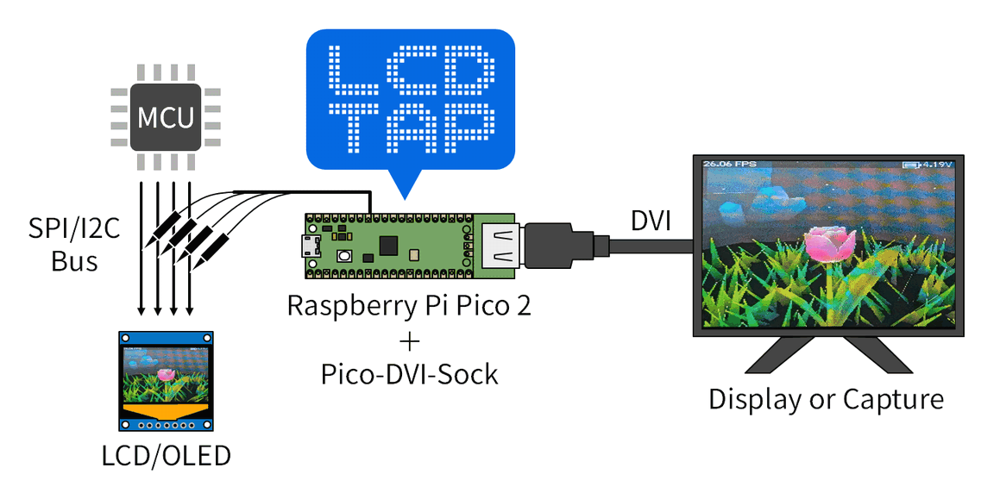

# LcdTap

A library and example that receives LCD controller commands (via SPI or I2C)
and outputs the framebuffer as a DVI-D signal.

## Example Design

### for ST7789, ILI9341, etc.

See [pico2_st7789](example/pico2_st7789/README.md) for build
instructions, pin assignment, and configuration details.

### for SSD1306, SSD1309, etc.

See [pico2_ssd1306](example/pico2_ssd1306/README.md) for build
instructions, pin assignment, and configuration details.

## Download Pre-built Binary

See [releases](https://github.com/shapoco/lcdtap/releases) for pre-built UF2 binaries.

## Video

https://github.com/user-attachments/assets/6f17d5dc-84d3-4a2a-a3ea-fca37591515f

## Configuration for M5Stack CoreS3

### Firmware

Use pre-built firmware `lcdtap_pico2_st7789.uf2`

### Connection

The M5Stack CoreS3 does not expose the CS signal on the connector, so it must be routed directly from the board. Solder a wire to R49 on the back of the board. The remaining signals can be obtained from the rear connector. On CoreS3, MISO is used as DCX.

|LcdTap (Pico2)|Connection|
|:--|:--|
|GND|CoreS3's GND|
|GPIO0 (CFG_CLK_MODE)|Pico2's GND (Normal Mode)|
|GPIO1 (RESX)|Pico2's 3V3|
|GPIO2 (SCLK)|CoreS3's SPI_SCLK|
|GPIO4 (MOSI)|CoreS3's SPI_MOSI|
|GPIO5 (DCX)|CoreS3's SPI_MISO|
|GPIO6 (CS)|CoreS3's R49 (back of board, see photo)|
|GPIO20 (CFG_LCD_SIZE)|Pico2's 3V3 (320x240)|
|GPIO21 (CFG_DVI_RES)|Select according to your display|
|GPIO22 (CFG_SWAP_RB)|Pico2's 3V3 (swap R/B)|
|GPIO26/27 (CFG_ROT0/1)|Pico2's GND (no rotation)|
|GPIO28 (CFG_INV_POL)|Pico2's 3V3 (inverted)|

## License

MIT License — see [LICENSE](LICENSE).
