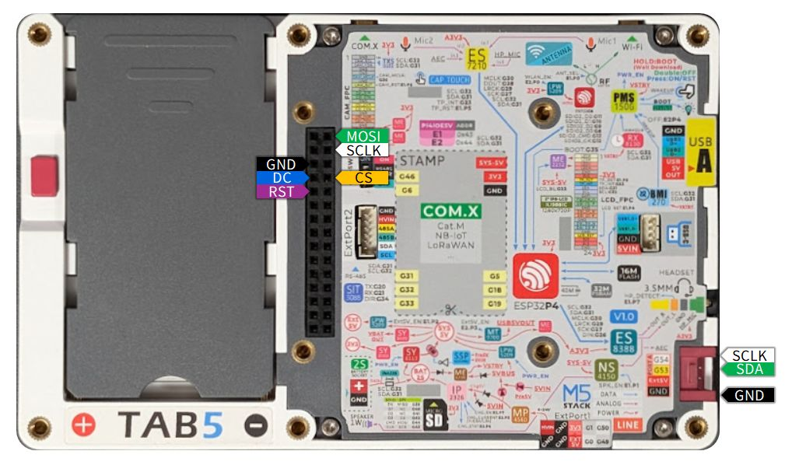

# LcdTap-Tab5

An implementation example that lets the Tab5 act as an SPI/I2C-connected LCD
display. It receives LCD controller commands on the rear port (M-Bus /
Grove) and renders them via M5GFX onto the built-in 1280x720 MIPI-DSI panel.

## Features

### I2C slave

Use the Grove connector on the side of Tab5 as an I2C slave and draw on the
Tab5 screen using SSD1306-compatible commands. The I2C slave address is 0x3C.

### SPI slave

Use the M-Bus connector on the back of Tab5 as an SPI slave and draw on the
Tab5 screen with 4-wire SPI (MOSI/D/C/CS).
All signals including RESX must be connected.

The input interface has I2C selected by default.
To switch to SPI, select 4-Line SPI in the Interface menu of the OSD.

### OSD and keypad

When you tap the screen, a semi-transparent keypad appears on the screen.
Tap the return key icon to open the OSD menu where you can change various settings.
Settings are saved on the Tab5 device.

### Support for controllers other than SSD1306

Other controllers besides SSD1306 can be selected in the OSD, but
they may not work correctly due to performance and hardware constraints.

## Wiring

| Signal | GPIO | Location | Notes |
|---|---|---|---|
| SPI SCK | G17 | M-Bus ||
| SPI MOSI | G16 | M-Bus ||
| SPI D/C | G18 | M-Bus | |
| SPI CS | G45 | M-Bus | active-low, pulled up |
| RESX | G19 | M-Bus | active-low, pulled up, shared by SPI/I2C |
| (reserved) | G52 | M-Bus | Dummy clock for priming. **Leave unconnected** |
| (reserved) | G51 | M-Bus | CS substitute for priming (driven High). **Leave unconnected** |
| I2C SDA | G53 | Grove | Slave address 0x3C |
| I2C SCL | G54 | Grove | External pull-up (2.2k-10kΩ) recommended |



Notes on I2C wiring:

- Signal level is **3.3V only** (the ESP32-P4 is not 5V tolerant).
- If the original display is left connected in parallel on the bus, the
  address 0x3C collides, but reception (wired-AND) still works for both.
- Since clock stretching is not performed, this also works alongside
  bit-bang masters that don't check SCL (in exchange, reads return
  best-effort dummy values).

## Pre-built firmware

Pre-built firmware is available on the [M5Burner](https://docs.m5stack.com/en/uiflow/m5burner/intro). Search for "LcdTap".

## Build

Uses native ESP-IDF (idf.py). **ESP-IDF v5.5.x is required**
(the ESP-IDF build of M5GFX/M5Unified has only been verified up through
the v5.5.x series, and `i2c_slave.cpp` also requires
`ESP_IDF_VERSION >= 5.5`; v6.0 is not supported).

```sh
source <path-to-ESP-IDF>/export.sh
idf.py set-target esp32p4
idf.py build              # build
idf.py -p <PORT> flash    # flash
idf.py -p <PORT> monitor  # serial log (115200 bps)
```

Display, touch, IMU, and power bring-up use M5Unified/M5GFX as ESP-IDF
components (pulled in via `main/idf_component.yml`; `m5stack/m5gfx` is
pinned to an exact version because `async_blit.cpp` obtains the DSI
panel's raw framebuffer via an internal header).

The core library `lib/` is pulled in as an IDF component via
`EXTRA_COMPONENT_DIRS` in `CMakeLists.txt` (the `ESP_PLATFORM` branch in
`lib/CMakeLists.txt`). Its component name under IDF is derived from the
directory name, `lib` (see `REQUIRES` in `main/CMakeLists.txt`).

## Limitations / Notes

- Only **I2C** and **SPI (4-wire)** buses are supported. SPI 3-wire and
  8-bit parallel are not supported (selecting them in the OSD is
  ignored).
- Screen refresh is best-effort (LcdTap's framebuffer is transferred to
  the DSI panel in strips).
- The maximum SPI clock depends on the upper limit of PARLIO RX's
  external clock. Around 50 MHz is the target, but this needs to be confirmed
  by measurement on real hardware, including the effect of GPIO matrix
  delay.
