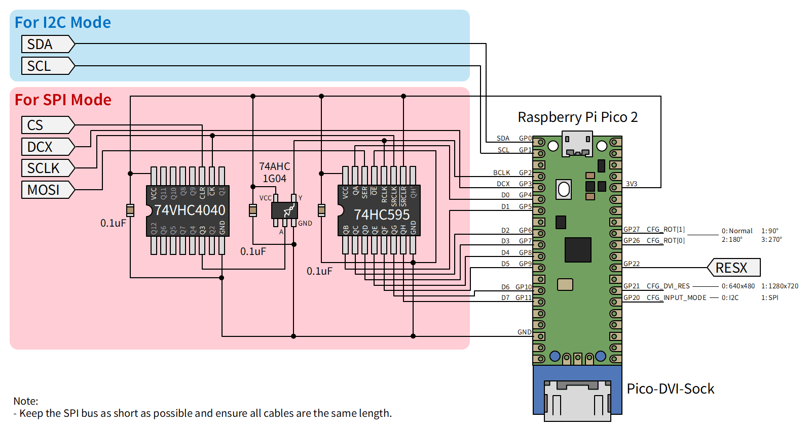

# Sample program for Raspberry Pi Pico2 — SSD1306

## Schematic



The rotary switch can be substituted with a DIP switch.

## Build instructions

```bash
cd example/pico2_ssd1306
mkdir build && cd build
cmake .. -DPICO_SDK_PATH=/path/to/pico-sdk
make -j4
```

To override the framebuffer size, pass optional `-D` flags to `cmake`:

```bash
cmake .. -DPICO_SDK_PATH=/path/to/pico-sdk \
         -DLCDTAP_LCD_SIZE_W=128 -DLCDTAP_LCD_SIZE_H=64
```

| cmake option | Default | Description |
|---|---|---|
| `LCDTAP_LCD_SIZE_W` | `128` | Framebuffer width |
| `LCDTAP_LCD_SIZE_H` | `64` | Framebuffer height |

## Input modes

This example supports two input modes, selectable via GPIO 20 at startup.

### I2C mode (default)

Connect the SSD1306 SDA and SCL lines directly to GPIO 8 and GPIO 9 with
4.7 kΩ pull-ups to 3.3 V. The Pico 2 acts as an I2C slave at address
`0x3C` (SA0 tied low). The SSD1306 I2C control byte (first byte after the
address phase) is decoded to determine whether subsequent bytes are commands
or GDDRAM data.

### SPI mode

SPI bytes are received directly by a PIO state machine (`spi_slave_with_dcx`
in `src/spi_slave.pio`) — no external ICs are required. Connect the SPI
master signals directly to the Pico 2 GPIOs as shown in the pin table below.

The program samples MOSI and DCX simultaneously on each SCLK rising edge
(CPOL=0, CPHA=0, MSB first). At 252 MHz system clock the maximum supported
SPI clock is **84 MHz**. A GPIO interrupt on CS (rising edge) resets the PIO
state machine between transactions, discarding any partially received byte.

## Pin assignment

| GPIO  | Direction | Function |
|-------|-----------|----------|
| 1     | IN        | RESX — hardware reset, active-low (SPI mode, pull-up on board) |
| 2     | IN        | SCLK — SPI clock from master (SPI mode, CPOL=0: idle LOW) |
| 4     | IN        | MOSI — SPI data from master, MSB first (SPI mode) |
| 5     | IN        | DCX — D/C# signal from master (SPI mode) |
| 6     | IN        | CS — chip select, active-low (SPI mode, pull-up on board) |
| 8     | IN        | I2C SDA (I2C mode only) |
| 9     | IN        | I2C SCL (I2C mode only) |
| 12–19 | OUT       | DVI TMDS output (pico\_sock\_cfg, driven by PicoDVI) |
| 20    | IN        | CFG: input mode select |
| 21    | IN        | CFG: DVI output resolution select |
| 25    | OUT       | Onboard LED |
| 26    | IN        | CFG: output rotation bit 0 |
| 27    | IN        | CFG: output rotation bit 1 |

## Configuration GPIOs

All configuration pins are read once at startup with internal pull-downs
(default = LOW). Pull HIGH to select the alternate option.

The output rotation is re-checked every DVI frame; changes take effect on the
next frame without restarting.

| GPIO  | Name          | LOW (default)           | HIGH (alternate)           |
|-------|---------------|-------------------------|----------------------------|
| 20    | INPUT\_MODE   | I2C mode (default)      | SPI mode                   |
| 21    | DVI\_RES      | 640×480 @ 60 Hz         | 1280×720 @ 30 Hz (reduced) |
| 26+27 | ROT           | 00 = no rotation        | 01/10/11 = see table below |

`ROT` is a 2-bit field: GPIO 27 is bit 1 (MSB) and GPIO 26 is bit 0 (LSB).

| ROT value | Effect |
|-----------|--------|
| `00`      | No rotation (default) |
| `01`      | 90° clockwise — aspect ratio swapped for FIT |
| `10`      | 180° / flip |
| `11`      | 270° clockwise — aspect ratio swapped for FIT |

The scale mode is fixed to **FIT** (aspect-ratio-preserving letterbox /
pillarbox). The framebuffer size defaults to 128×64 pixels (overridable at
build time; see Build instructions).

## DVI output (PicoDVI / libdvi)

DVI output is handled by [PicoDVI](https://github.com/Wren6991/PicoDVI)
(`libdvi`).

- **Core 1** runs `dvi_scanbuf_main_16bpp()` in an infinite loop, consuming
  RGB565 scanline buffers from the `q_colour_valid` queue and serialising TMDS
  data to the DVI connector via PIO0 and DMA.
- **Core 0** (main loop) calls `inst.fillScanline()` for each line and
  pushes the filled buffer to `q_colour_valid`.

The system clock is raised to match the TMDS bit-clock requirement (252 MHz for
640×480, 319.2 MHz for 1280×720 reduced), and the voltage regulator is set to
1.20 V to support these higher frequencies.

PicoDVI uses PIO0 and claims its DMA channels inside `dvi_init()`. In SPI mode,
the SPI slave PIO program runs on PIO1 (SM0), and its DMA channel is
claimed after `dvi_init()` to avoid conflicts.
