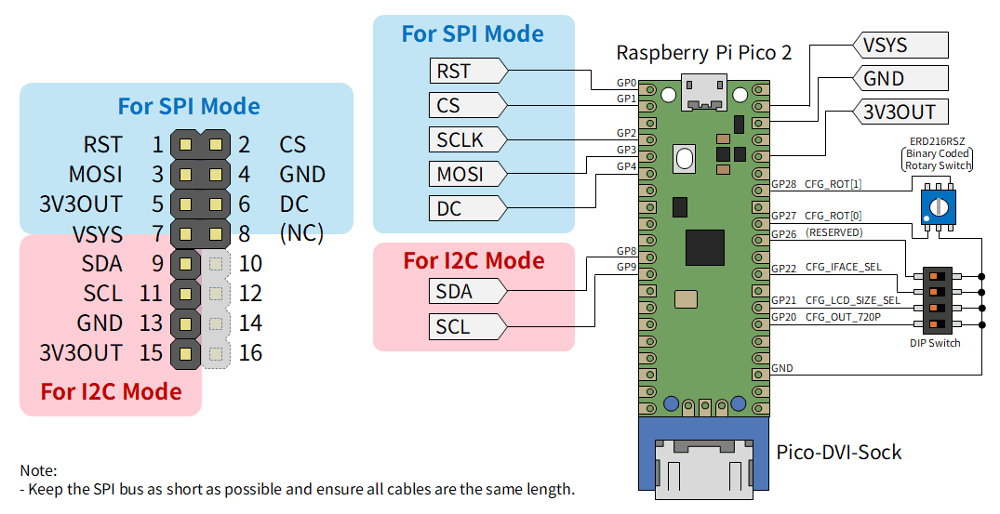

# LcdTap-Pico2 for SSD1306

## Schematics and Recommended Header Pinout



The rotary switch can be substituted with a DIP switch.

## Build instructions

```bash
cd example/pico2_ssd1306
mkdir build && cd build
cmake .. -DPICO_SDK_PATH=/path/to/pico-sdk
make -j4
```

To override the framebuffer size, pass optional `-D` flags to `cmake`:

```bash
cmake .. -DPICO_SDK_PATH=/path/to/pico-sdk \
         -DLCDTAP_LCD_SIZE1_W=128 -DLCDTAP_LCD_SIZE1_H=64 \
         -DLCDTAP_LCD_SIZE2_W=128 -DLCDTAP_LCD_SIZE2_H=32
```

| CMake option | Default | Description |
|---|---|---|
| `LCDTAP_LCD_SIZE1_W` | `128` | Width of LCD size 1 |
| `LCDTAP_LCD_SIZE1_H` | `64` | Height of LCD size 1 |
| `LCDTAP_LCD_SIZE2_W` | `128` | Width of LCD size 2 |
| `LCDTAP_LCD_SIZE2_H` | `32` | Height of LCD size 2 |

## Input modes

This example supports two input modes, selectable via CFG_IFACE_SEL at startup.

### I2C mode (default)

Connect SDA and SCL lines directly to the Pico 2 GPIOs as shown in the pin table below.
These GPIOs have internal pull-ups. The Pico 2 acts as an I2C slave at address `0x3C`.

### SPI mode

Connect the SPI master signals directly to the Pico 2 GPIOs as shown in the pin table below.

The SPI interface operates in Mode 0 (CPOL=0, CPHA=0) with MSB first. The maximum clock frequency depends on waveform quality but operates up to approximately 50 MHz.

## Video output

DVI signal generation uses Luke Wren's excellent library [PicoDVI](https://github.com/Wren6991/PicoDVI), and signal output uses his [Pico-DVI-Sock](https://github.com/Wren6991/Pico-DVI-Sock).

## Pin assignment

| GPIO  | Direction | Name | Active-low | Internal Pull-up | Description |
|:--:|:--:|:--|:--:|:--:|:--|
| 0     | IN        | RST | v | v | LCD Hardware reset (SPI mode) |
| 1     | IN        | CS | v | v | LCD Chip select (SPI mode) |
| 2     | IN        | SCLK | | | SPI clock from master (SPI mode) |
| 3     | IN        | MOSI | | | SPI data from master (SPI mode) |
| 4     | IN        | DC | | | D/C# signal from master (SPI mode) |
| 8     | IN        | SDA | | v | I2C data (I2C mode) |
| 9     | IN        | SCL | | v | I2C clock (I2C mode) |
| 12–19 | OUT       | (DVI signals) | | | Driven by PicoDVI |
| 20    | IN        | CFG_OUT_720P | v | v | High=640×480@60Hz,<br>Low=1280×720@30Hz |
| 21    | IN        | CFG_LCD_SIZE_SEL | v | v | High=Size1, Low=Size2 |
| 22    | IN        | CFG_IFACE_SEL | v | v | High=I2C, Low=SPI |
| 27    | IN        | CFG_ROT\[0\] | v | v | Output rotation bit 0 |
| 28    | IN        | CFG_ROT\[1\] | v | v | Output rotation bit 1 |

CFG_ROT\[1:0\] are read every frame and reflected immediately. Other configuration pins are read at startup.

### CFG_ROT\[1:0\]

Selects the output rotation as follows:

|CFG_ROT\[1\]|CFG_ROT\[0\]|Direction|
|:--:|:--:|:--|
|High|High|No rotation (default)|
|High|Low|90° clockwise|
|Low|High|180°|
|Low|Low|270° clockwise|
