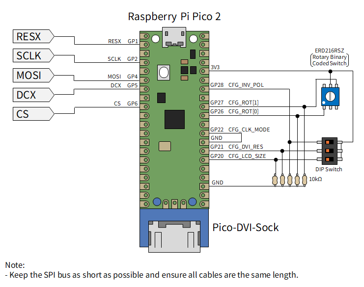
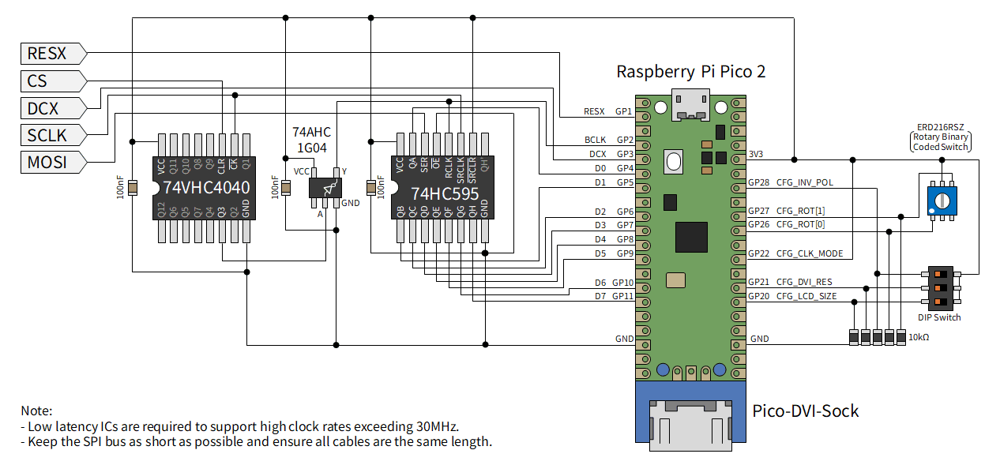

# Sample program for Raspberry Pi Pico2

## Build instructions

```bash
cd example/pico2_st7789
mkdir build && cd build
cmake .. -DPICO_SDK_PATH=/path/to/pico-sdk
make -j4
```

## Operating modes

This program supports two input modes selected at startup by **GPIO 22
(CLK\_MODE)**. Pull GPIO 22 LOW (or leave it unconnected — internal pull-down)
for Normal Mode; pull it HIGH for Fast Mode.

### Normal Mode (GPIO 22 = LOW, default)

Direct SPI slave connection — **no external ICs required**. Supports SPI clock up to approximately 40 MHz.



The rotary switch can be substituted with a DIP switch.

| GPIO  | Direction | Function |
|-------|-----------|----------|
| 1     | IN        | RESX — hardware reset, active-low (pull-up on board) |
| 2     | IN        | SCLK — SPI clock (CPOL=0: idles LOW) |
| 4     | IN        | MOSI — SPI data, MSB first |
| 5     | IN        | DCX — D/C# signal |
| 6     | IN        | CS — chip select, active-low (pull-up on board) |
| 12–19 | OUT       | DVI TMDS output (pico\_sock\_cfg, driven by PicoDVI) |
| 20    | IN        | CFG: LCD size select |
| 21    | IN        | CFG: DVI output resolution select |
| 22    | IN        | CFG: CLK\_MODE — LOW = Normal Mode (this mode) |
| 25    | OUT       | Onboard LED |
| 26    | IN        | CFG: output rotation bit 0 |
| 27    | IN        | CFG: output rotation bit 1 |
| 28    | IN        | CFG: inversion polarity |

### Fast Mode (GPIO 22 = HIGH)

Parallel byte interface via external ICs — tested up to 62.5 MHz SPI clock.



The rotary switch can be substituted with a DIP switch.

| GPIO  | Direction | Function |
|-------|-----------|----------|
| 1     | IN        | RESX — hardware reset, active-low (pull-up on board) |
| 2     | IN        | BCLK — byte clock = SCLK÷8 (74AHC1G04 output, HIGH when byte complete) |
| 3     | IN        | DCX — D/C# signal (direct from SPI master) |
| 4–11  | IN        | D[0..7] — parallel data (74HC595 Q1–Q8 outputs) |
| 12–19 | OUT       | DVI TMDS output (pico\_sock\_cfg, driven by PicoDVI) |
| 20    | IN        | CFG: LCD size select |
| 21    | IN        | CFG: DVI output resolution select |
| 22    | IN        | CFG: CLK\_MODE — HIGH = Fast Mode (this mode) |
| 25    | OUT       | Onboard LED |
| 26    | IN        | CFG: output rotation bit 0 |
| 27    | IN        | CFG: output rotation bit 1 |
| 28    | IN        | CFG: inversion polarity |

## Configuration GPIOs

All configuration pins are read once at startup with internal pull-downs
(default = LOW). Pull HIGH to select the alternate option.

| GPIO  | Name          | LOW (default)           | HIGH (alternate)               |
|-------|---------------|-------------------------|--------------------------------|
| 20    | LCD\_SIZE     | 240×240                 | 240×320                        |
| 21    | DVI\_RES      | 640×480 @ 60 Hz         | 1280×720 @ 30 Hz (reduced)     |
| 22    | CLK\_MODE     | Normal Mode (SPI slave) | Fast Mode (parallel slave)     |
| 26+27 | ROT           | 00 = no rotation        | 01/10/11 = see table below     |
| 28    | INV\_POL      | INVON → inverted        | INVON → normal (polarity flip) |

`ROT` is a 2-bit field: GPIO 27 is bit 1 (MSB) and GPIO 26 is bit 0 (LSB).
The output rotation is re-checked every DVI frame; changes take effect on the
next frame without restarting.

| ROT value | Effect |
|-----------|--------|
| `00`      | No rotation (default) |
| `01`      | 90° clockwise — aspect ratio swapped for FIT / PIXEL\_PERFECT |
| `10`      | 180° / flip |
| `11`      | 270° clockwise — aspect ratio swapped for FIT / PIXEL\_PERFECT |

The scale mode is fixed to **FIT** (aspect-ratio-preserving letterbox / pillarbox).

`INV_POL` controls how the ST7789 INVON/INVOFF commands are interpreted.
The default (LOW) matches the ST7789 datasheet polarity.

## DVI output (PicoDVI / libdvi)

DVI output is handled by [PicoDVI](https://github.com/Wren6991/PicoDVI)
(`libdvi`).

- **Core 1** runs `dvi_scanbuf_main_16bpp()` in an infinite loop, consuming
  RGB565 scanline buffers from the `q_colour_valid` queue and serialising TMDS
  data to the DVI connector via PIO0 and DMA.
- **Core 0** (main loop) calls `inst.fillScanline()` for each line and
  pushes the filled buffer to `q_colour_valid`.

The system clock is raised to match the TMDS bit-clock requirement (252 MHz for
640×480, 319.2 MHz for 1280×720 reduced), and the voltage regulator is set to
1.20 V to support these higher frequencies.

PicoDVI uses PIO0 and claims its DMA channels inside `dvi_init()`. The input
slave PIO program runs on PIO1 (SM0), and its DMA channel is claimed after
`dvi_init()` to avoid conflicts.
