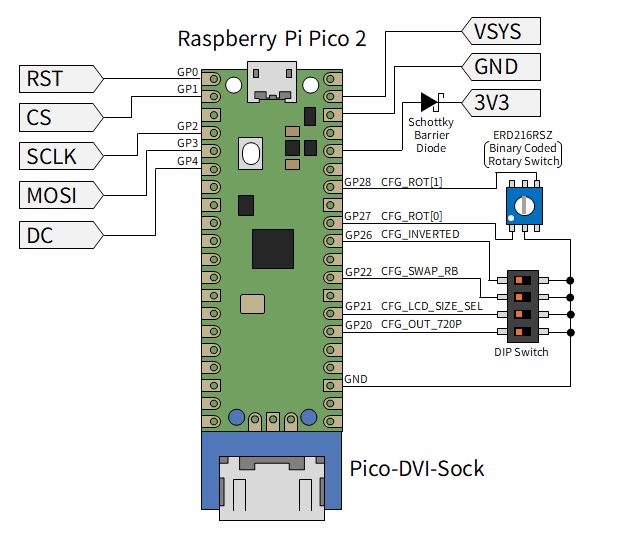

# LcdTap-Pico2 for ST7789

## Schematics

- Keep the SPI/I2C bus as short as possible and ensure all cables are the same length.
- The rotary switch can be substituted with a DIP switch.
- See also: [Recommended Header Pinout](../../README.md#recommended-header-pinout)



## Build instructions

```bash
cd example/pico2_st7789
mkdir build && cd build
cmake .. -DPICO_SDK_PATH=/path/to/pico-sdk
make -j4
```

To override the framebuffer size, pass optional `-D` flags to `cmake`:

```bash
cmake .. -DPICO_SDK_PATH=/path/to/pico-sdk \
         -DLCDTAP_LCD_SIZE1_W=240 -DLCDTAP_LCD_SIZE1_H=320 \
         -DLCDTAP_LCD_SIZE2_W=320 -DLCDTAP_LCD_SIZE2_H=240
```

| CMake option | Default | Description |
|---|---|---|
| `LCDTAP_LCD_SIZE1_W` | `240` | Width of LCD size 1 |
| `LCDTAP_LCD_SIZE1_H` | `320` | Height of LCD size 1 |
| `LCDTAP_LCD_SIZE2_W` | `320` | Width of LCD size 2 |
| `LCDTAP_LCD_SIZE2_H` | `240` | Height of LCD size 2 |

## Video output

DVI signal generation uses Luke Wren's excellent library [PicoDVI](https://github.com/Wren6991/PicoDVI), and signal output uses his [Pico-DVI-Sock](https://github.com/Wren6991/Pico-DVI-Sock).

## Operating modes

Connect the SPI master signals directly to the Pico 2 GPIOs as shown in the pin table below.

The SPI interface operates in Mode 0 (CPOL=0, CPHA=0) with MSB first. The maximum clock frequency depends on waveform quality but operates up to approximately 50 MHz.

| GPIO  | Direction | Name | Active-low | Internal Pull-up | Description |
|:--:|:--:|:--|:--:|:--:|:--|
| 0     | IN        | RST | v | v | LCD Hardware reset |
| 1     | IN        | CS | v | v | LCD Chip select |
| 2     | IN        | SCLK | | | SPI clock from master |
| 3     | IN        | MOSI | | | SPI data from master |
| 4     | IN        | DC | | | D/C# signal from master |
| 12–19 | OUT       | (DVI signals) | | | Driven by PicoDVI |
| 20    | IN        | CFG_OUT_720P | v | v | High=640×480@60Hz,<br>Low=1280×720@30Hz |
| 21    | IN        | CFG_LCD_SIZE_SEL | v | v | High=Size1, Low=Size2 |
| 22    | IN        | CFG_SWAP_RB | v | v | High=Normal, Low=Swapped |
| 26    | IN        | CFG_INVERTED | v | v | High=Normal, Low=Inverted |
| 27    | IN        | CFG_ROT\[0\] | v | v | Output rotation bit 0 |
| 28    | IN        | CFG_ROT\[1\] | v | v | Output rotation bit 1 |

CFG_ROT\[1:0\] are read every frame and reflected immediately. Other configuration pins are read at startup.

### CFG_SWAP_RB

Setting CFG_SWAP_RB (GPIO22) high or low selects whether the red and blue colour channels are swapped in the output. This is useful for displays with different native colour orders (e.g. RGB565 vs BGR565).

### CFG_INVERTED

Setting CFG_INVERTED (GPIO26) high or low selects whether the output image is colour-inverted. This is useful for displays with different polarity requirements for the RGB signals.

### Rotation select

|CFG_ROT\[1\]|CFG_ROT\[0\]|Direction|
|:--:|:--:|:--|
|High|High|No rotation (default)|
|High|Low|90° clockwise|
|Low|High|180°|
|Low|Low|270° clockwise|
