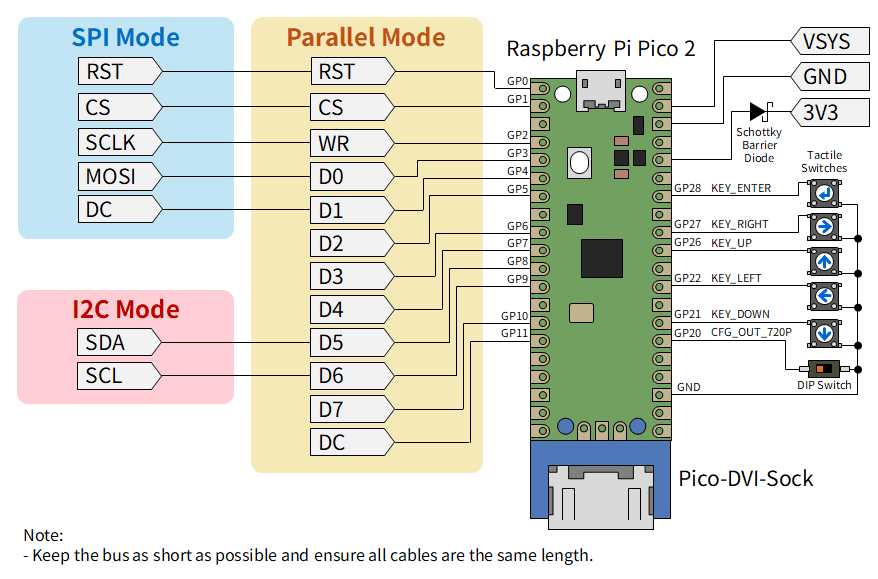
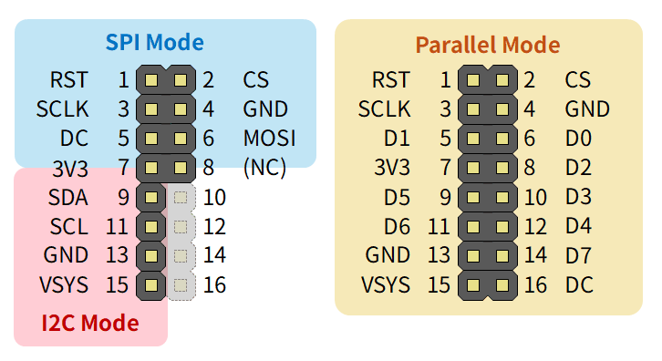
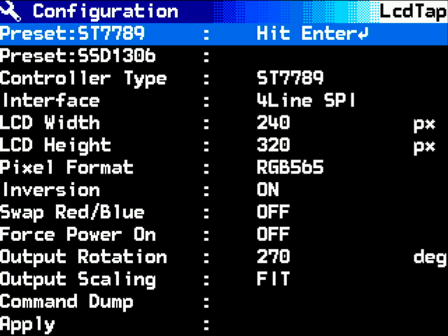
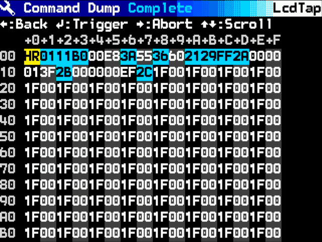
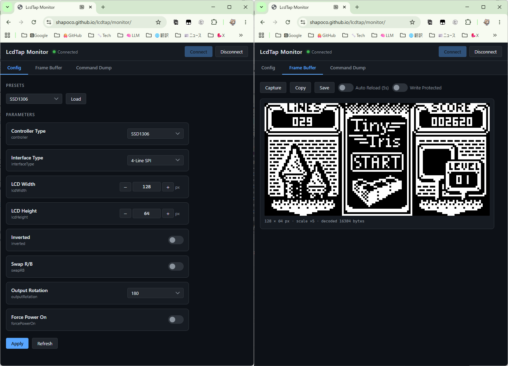
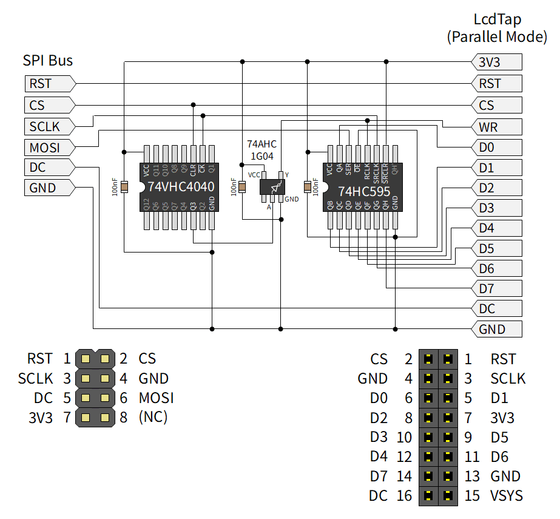

# LcdTap-Pico2 Universal

A universal LCD-to-DVI converter example for Raspberry Pi Pico 2. With an OSD (On-Screen Display) menu for runtime configuration.

## Features

- Supports four input interfaces selectable via OSD: I2C, 4-Line SPI, 3-Line SPI, 8-bit Parallel
- Runtime configuration via OSD menu: interface, controller type, pixel format, LCD size, inversion, R/B swap, rotation, scale mode
- Settings (including selected interface) saved to flash on Apply and restored at next boot
- DVI output: 640×480@60Hz or 1280×720@30Hz selectable via GPIO21 at boot
- USB CDC serial interface for remote configuration and framebuffer readout from a PC or smartphone

> [!WARNING]
> Parallel Mode has not been tested yet. Please let me know if it works!

## Schematics and Recommended Header Pinout





## OSD Menu

Press the Enter key to open the configuration menu.



### While OSD is closed

| Key | Action |
|-----|--------|
| Left / Right | Cycle output rotation (0° → 90° → 180° → 270°) and save immediately |
| Enter | Open the OSD menu |

### While OSD is open

| Key | Action |
|-----|--------|
| Up / Down | Navigate menu items |
| Left / Right | Adjust selected value |
| Enter on Apply | Apply changes and save to flash |
| Enter on Cancel | Discard changes and close |
| Enter on Command Dump | Open the command dump viewer |

### Command Dump Viewer

Selecting **Command Dump** opens a hex viewer that shows the raw LCD command/data stream captured since power-on (or since the last trigger).



| Key | Action |
|-----|--------|
| Enter | Clear buffer and start a new capture |
| Right | Stop capture (mark complete) |
| Left | Return to the configuration menu |
| Up / Down | Scroll |

Each row displays 16 entries. Colors indicate the type of each entry:

| Color | Meaning |
|-------|---------|
| Black on cyan | Command byte |
| White on black / dark-gray (alternating) | Data byte |
| Black on yellow (`HR`) | Hardware reset event |
| `..` in dark gray | Empty (not yet captured) |

## USB Serial Interface

LcdTap-Pico2 Universal exposes a USB CDC (virtual COM port) that accepts JSON commands terminated with CRLF (`\r\n`).

### Quick start

Connect via any serial terminal at any baud rate (USB CDC ignores baud):

```
{"command":"hello"}
```

Response:

```
{"response":"welcome lcdtap"}
```

### Supported commands

| Command | Description |
|---------|-------------|
| `hello` | Verify the connection |
| `getparams` | Get all configuration parameters as JSON |
| `setparams` | Update one or more parameters and save to flash |
| `getframebuffer` | Read the current framebuffer as Base64-encoded RGB565 |
| `cmddump_start` | Start capturing the LCD command stream |
| `cmddump_abort` | Abort an in-progress capture |
| `cmddump_forcetrigger` | Force the capture to the active state immediately |
| `cmddump_getstatus` | Get the capture state (`WAIT`, `ACTIVE`, or `COMPLETE`) |
| `cmddump_read` | Read the captured command data as Base64 |

See [UART_PROTOCOL.md](UART_PROTOCOL.md) for the full protocol specification.

### Example: read framebuffer with Python

```python
import serial, base64, struct
from PIL import Image

port = serial.Serial('/dev/ttyACM0', timeout=5)
port.write(b'{"command":"getframebuffer"}\r\n')
resp = port.readline()

import json
j = json.loads(resp)
w, h = j['width'], j['height']
raw = base64.b64decode(j['data'])
pixels = struct.unpack(f'<{w*h}H', raw)

img = Image.new('RGB', (w, h))
img.putdata([(((p>>11)&0x1F)<<3, ((p>>5)&0x3F)<<2, (p&0x1F)<<3) for p in pixels])
img.save('framebuffer.png')
```

### Example: change LCD resolution

```
{"command":"setparams","params":{"lcdWidth":128,"lcdHeight":64}}
```

## GPIO Assignments

### Common (all modes)

| GPIO  | Direction | Name | Active-low | Internal Pull-up | Description |
|:--:|:--:|:--|:--:|:--:|:--|
| 0     | IN        | RST | v | v | LCD Hardware reset (SPI mode) |
| 12–19 | OUT       | (DVI signals) | | | Driven by PicoDVI |
| 20    | IN        | CFG_OUT_720P | v | v | High=640×480@60Hz,<br>Low=1280×720@30Hz |
| 21    | IN        | KEY_DOWN | v | v | Low=pressed |
| 22    | IN        | KEY_LEFT | v | v | Low=pressed |
| 26    | IN        | KEY_UP | v | v | Low=pressed |
| 27    | IN        | KEY_RIGHT | v | v | Low=pressed |
| 28    | IN        | KEY_ENTER | v | v | Low=pressed |

### I2C Mode

| GPIO  | Direction | Name | Active-low | Internal Pull-up | Description |
|:--:|:--:|:--|:--:|:--:|:--|
| 8     | IN        | SDA | | v | I2C data |
| 9     | IN        | SCL | | v | I2C clock |

### 4-Line/3-Line SPI Mode

| GPIO  | Direction | Name | Active-low | Internal Pull-up | Description |
|:--:|:--:|:--|:--:|:--:|:--|
| 1     | IN        | CS | v | v | LCD Chip select |
| 2     | IN        | SCLK | | | SPI clock from master |
| 3     | IN        | MOSI | | | SPI data from master |
| 4     | IN        | DC | | | D/C# signal from master (4-line mode only) |

### Parallel Mode

| GPIO  | Direction | Name | Active-low | Internal Pull-up | Description |
|:--:|:--:|:--|:--:|:--:|:--|
| 1 | IN | CS | v | v | LCD Chip select|
| 2 | IN | WR | | | Write strobe |
| 3–10 | IN | D[0..7] | | | parallel data |
| 11 | IN | DC | | | D/C# signal |

## UART/Web App

LcdTap-Pico2 Universal accepts JSON commands over the USB CDC serial interface.
This allows remote configuration and framebuffer readout from a PC.

Available here: https://shapoco.github.io/lcdtap/monitor



## Build

```bash
export PICO_SDK_PATH=/path/to/pico-sdk
./build.sh
```

The UF2 file is generated at `build/lcdtap_pico2_universal.uf2`.

### CMake Options

| Option | Default | Description |
|--------|---------|-------------|
| `LCDTAP_LCD_SIZE_W` | 240 | Initial LCD framebuffer width (px) |
| `LCDTAP_LCD_SIZE_H` | 320 | Initial LCD framebuffer height (px) |

Example:

```bash
cmake .. -DCMAKE_BUILD_TYPE=Release -DPICO_BOARD=pico2 \
         -DLCDTAP_LCD_SIZE_W=320 -DLCDTAP_LCD_SIZE_H=240
```

## Supporting High-Speed SPI Clocks Above 40MHz

The SPI interface of LcdTap-Pico2 Universal can support clock frequencies up to approximately 40MHz. For frequencies exceeding this, you can add an external deserializer outside the Pico2 to support higher speeds. In this case, select Parallel as the Interface in the OSD menu.



## Troubleshooting

### Failed to boot normally

Try powering on or resetting while pressing the Left key. This will boot while ignoring the settings saved in flash.
