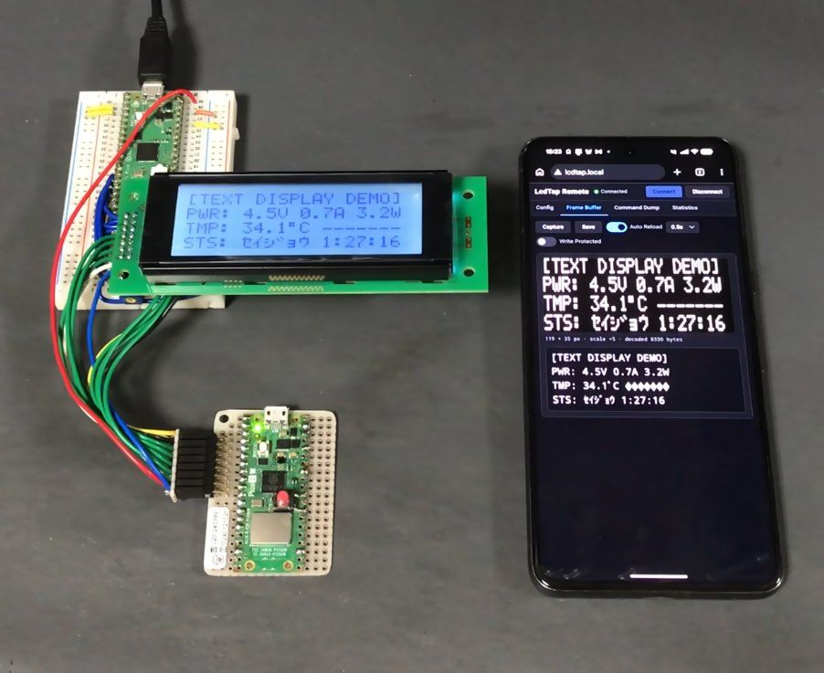

# LcdTap pico2w_remote

LcdTap implementation for Raspberry Pi Pico 2 W. Using the same input interface as
pico2_universal (I2C / 4-wire SPI / 3-wire SPI / 8-bit parallel with identical pin layout),
it captures LCD controller traffic and reads the screen **without video output** via WiFi
through HTTP JSON API and built-in Web UI on the device.

## Features

- HTTP Server (port 80)
  - `GET /` — Web page with the same UI as LcdTap Monitor (firmware built-in)
  - `POST /api` — Same JSON command set as pico2_universal's UART I/F
- USB CDC Serial — Same JSON command set + WiFi setup
  (`getnetconfig` / `setnetconfig` / `netstatus`)
- mDNS — `http://<hostname>.local/` (default `lcdtap.local`)
- Settings are stored in Flash

## Setup

1. Download the latest zip file from [releases](https://github.com/shapoco/lcdtap/releases), and extract `lcdtap_pico2w_remote.uf2`.
2. Connect Raspberry Pi Pico 2 W to your PC while holding the BOOTSEL button, and copy the uf2 file to the mounted drive.
3. Open [LcdTap Remote Setup](https://shapoco.github.io/lcdtap/remote/) in your browser,
   connect via WebSerial, and write SSID / passphrase, etc.
4. Pico2W reboots and attempts WiFi connection. When connection succeeds,
   LED stays on, and you can open Web UI at `http://lcdtap.local/` (or IP address).

## LED

| State | Pattern |
|---|---|
| WiFi Not Configured | 0.25 s on / 0.75 s off |
| Connecting | 0.25 s on / 0.25 s off |
| Connection Failed (Retry Waiting) | 0.5 s on / 0.5 s off |
| Connected | Always on + 50 ms off pulse on access |
