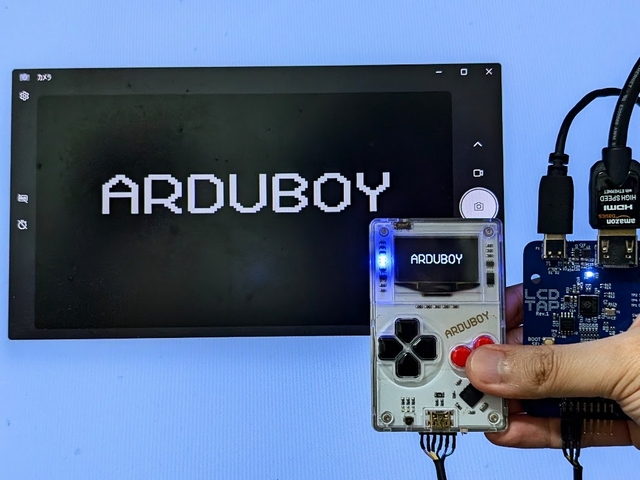

# Configuration for Arduboy

See also: [LcdTap: TinyJoyPad や Arduboy を大画面で遊ぶ](https://blog.shapoco.net/2026/0514-tinyjoypad-with-large-monitor/)

> [!CAUTION]
> Level shifter is required between Pico2 (3.3V) and Arduboy depending on its power supply voltage.

> [!CAUTION]
> The back side of the Arduboy board has exposed Li-Po battery terminals. Be careful not to short them.

## Using [LcdTap-Pico2 Universal](../../example/pico2_universal/)

### Connection

|LcdTap (Pico2)|Connection|
|:--|:--|
|GND|Arduboy's GND|
|GPIO0 (RST)|Arduboy's RST (Pin 27)|
|GPIO1 (CS)|Arduboy's CS (Pin 26)|
|GPIO2 (SCLK)|Arduboy's SCLK (Pin 15)|
|GPIO3 (MOSI)|Arduboy's MOSI (Pin 16)|
|GPIO4 (DC)|Arduboy's DC (Pin 25)|

### Configuration

1. Load preset for SSD1306.
2. Change the interface type to SPI.

## Using [LcdTap-Pico2 for SSD1306](../../example/pico2_ssd1306/)

### Connection

|LcdTap (Pico2)|Connection|
|:--|:--|
|GND|Arduboy's GND|
|GPIO0 (RST)|Arduboy's RST (Pin 27)|
|GPIO1 (CS)|Arduboy's CS (Pin 26)|
|GPIO2 (SCLK)|Arduboy's SCLK (Pin 15)|
|GPIO3 (MOSI)|Arduboy's MOSI (Pin 16)|
|GPIO4 (DC)|Arduboy's DC (Pin 25)|
|GPIO20 (CFG_OUT_720P)|Select according to your display|
|GPIO21 (CFG_LCD_SIZE_SEL)|Open or 3V3 (128x64)| 
|GPIO22 (CFG_IFACE_SEL)|GND (SPI)|
|GPIO27 (CFG_ROT\[0\])|Open or 3V3|
|GPIO28 (CFG_ROT\[1\])|GND (Rotate 180°)|
