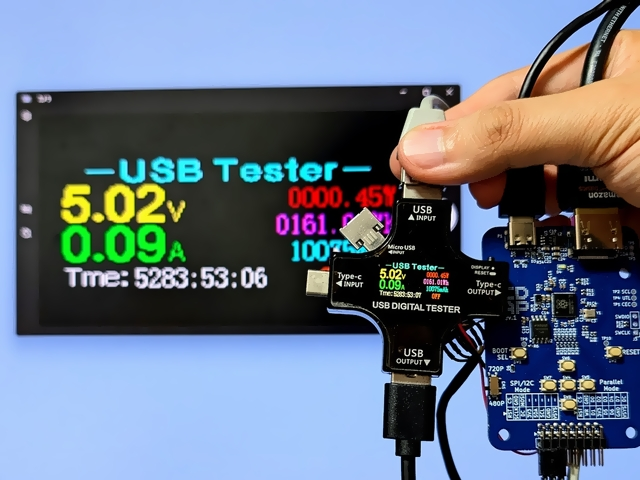
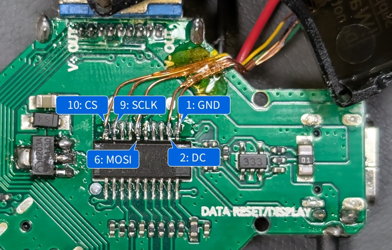

# Configuration for J7-c

## Using [LcdTap-Pico2 Universal](example/pico2_universal/README.md)

### Connection

|LcdTap (Pico2)|Connection|
|:--|:--|
|GND|J7-c GND|
|GPIO0 (RST)|Open or 3V3|
|GPIO1 (CS)|J7-c CS (Pin 10)|
|GPIO2 (SCLK)|J7-c SCLK (Pin 9)|
|GPIO3 (MOSI)|J7-c MOSI (Pin 6)|
|GPIO4 (DC)|J7-c DC (Pin 2)|

### Configuration

1. Load preset for ST7789.
2. Set resolution to 128x160.
3. Enable Swap R/B.
4. Set Output Rotation to 90°.