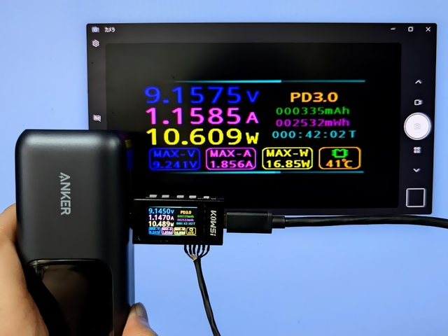
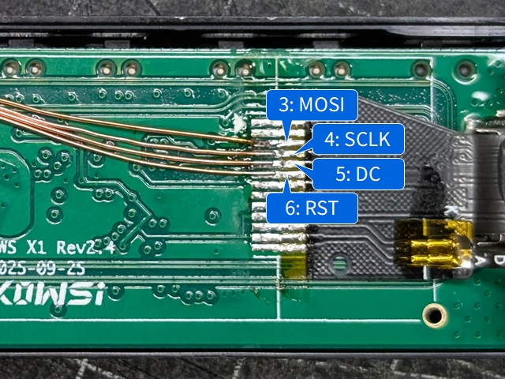

# Configuration for KWS-X1

## Using [LcdTap-Pico2 Universal](../../example/pico2_universal/)

### Connection

|LcdTap (Pico2)|Connection|
|:--|:--|
|GND|KWS-X1's GND|
|GPIO0 (RST)|KWS-X1's RST (Pin 6)|
|GPIO1 (CS)|Pico2's GND|
|GPIO2 (SCLK)|KWS-X1's SCLK (Pin 4)|
|GPIO3 (MOSI)|KWS-X1's MOSI (Pin 3)|
|GPIO4 (DC)|KWS-X1's DC (Pin 5)|

### Configuration

1. Load preset for ST7789.
2. Set Output Rotation to 270°.

## Using [LcdTap-Pico2 for ST7789](../../example/pico2_st7789/)

### Connection

|LcdTap (Pico2)|Connection|
|:--|:--|
|GND|KWS-X1's GND|
|GPIO0 (RST)|KWS-X1's RST (Pin 6)|
|GPIO1 (CS)|Pico2's GND|
|GPIO2 (SCLK)|KWS-X1's SCLK (Pin 4)|
|GPIO3 (MOSI)|KWS-X1's MOSI (Pin 3)|
|GPIO4 (DC)|KWS-X1's DC (Pin 5)|
|GPIO20 (CFG_OUT_720P)|Select according to your display|
|GPIO21 (CFG_LCD_SIZE_SEL)|Open or 3V3|
|GPIO22 (CFG_SWAP_RB)|Open or 3V3|
|GPIO26 (CFG_INVERTED)|GND (inverted)|
|GPIO28/27 (CFG_ROT\[1:0\])|GND (270°)|
