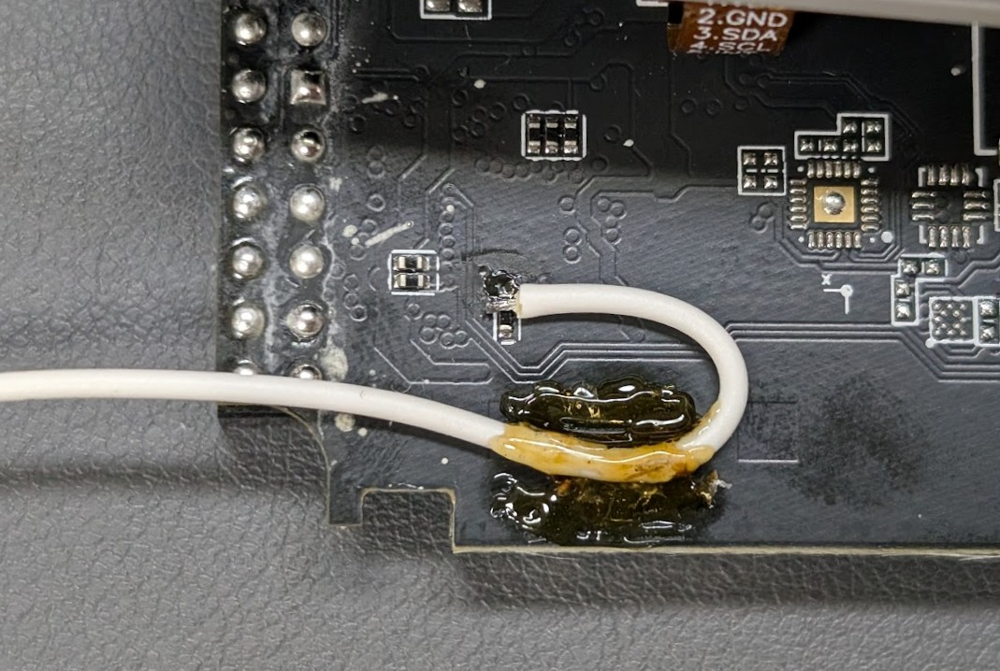

# Configuration for M5Stack CoreS3


See also: [LcdTap: M5Stack CoreS3 の画面をミラーリング/キャプチャする](https://blog.shapoco.net/2026/0520-m5stack-with-large-monitor/)

## Accessing the Chip Select Signal

The M5Stack CoreS3 does not have the CS signal exposed on the connector, so one of the following solutions is required.

### Method1: Route CS signal to M-Bus

Requires modifying `M5GFX.cpp` and recompiling, but no hardware modification is needed.

```diff
  void cs_control(bool flg) override
  {
    lgfx::Panel_ILI9342::cs_control(flg);

+   // GPIO5 を CS ピンに連動させる
+   lgfx::pinMode(GPIO_NUM_5, lgfx::pin_mode_t::output);
+   if (flg) {
+     lgfx::gpio_hi(GPIO_NUM_5);
+   } else {
+     lgfx::gpio_lo(GPIO_NUM_5);
+   }

    // CS操作時にGPIO35の役割を切り替える (MISO or D/C);

    // FSPIQ_IN_IDX==FSPI MISO / SIG_GPIO_OUT_IDX==GPIO OUT
    // *(volatile uint32_t*)GPIO_FUNC35_OUT_SEL_CFG_REG = flg ? FSPIQ_OUT_IDX : SIG_GPIO_OUT_IDX;

    // CS HIGHの場合はGPIO出力を無効化し、MISO入力として機能させる。
    // CS LOW の場合はGPIO出力を有効化し、D/Cとして機能させる。
    *(volatile uint32_t*)( flg
                           ? GPIO_ENABLE1_W1TC_REG
                           : GPIO_ENABLE1_W1TS_REG
                         ) = 1u << (GPIO_NUM_35 & 31);
  }
```

### Method2: Wire directly

Wire directly to R49 on the back of the board: Hardware modification is required, but no software changes are needed.



## Using [LcdTap-Pico2 Universal](../../example/pico2_universal/)

### Connection

|LcdTap (Pico2)|Connection|
|:--|:--|
|GND|CoreS3's GND|
|GPIO0 (RST)|Pico2's 3V3|
|GPIO1 (CS)|(See above instructions)|
|GPIO2 (SCLK)|CoreS3's SPI_SCLK|
|GPIO3 (MOSI)|CoreS3's SPI_MOSI|
|GPIO4 (DC)|CoreS3's SPI_MISO|

### Configuration

1. Load preset for ST7789.
2. Set LCD size to 320x240.
3. Turn-on Swap R/B.
4. Set Output Rotation to 0°.

## Using [LcdTap-Pico2 for ST7789](../../example/pico2_st7789/)

### Connection

|LcdTap (Pico2)|Connection|
|:--|:--|
|GND|CoreS3's GND|
|GPIO0 (RST)|3V3|
|GPIO1 (CS)|(See above instructions)|
|GPIO2 (SCLK)|CoreS3's SPI_SCLK|
|GPIO3 (MOSI)|CoreS3's SPI_MOSI|
|GPIO4 (DC)|CoreS3's SPI_MISO|
|GPIO20 (CFG_OUT_720P)|Select according to your display|
|GPIO21 (CFG_LCD_SIZE_SEL)|GND (320x240)|
|GPIO22 (CFG_SWAP_RB)|GND (swap R/B)|
|GPIO26 (CFG_INVERTED)|GND (inverted)|
|GPIO27/28 (CFG_ROT\[1:0\])|Open or 3V3 (0°)|
