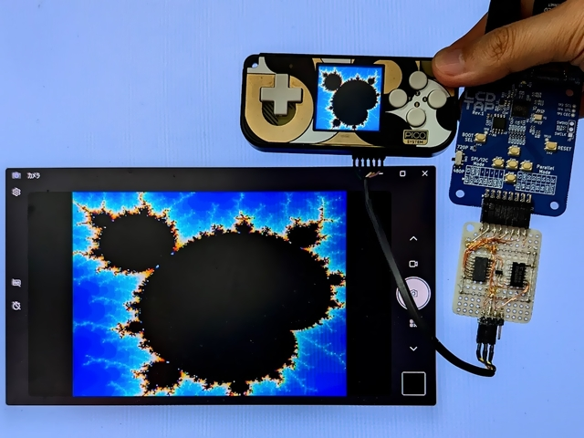
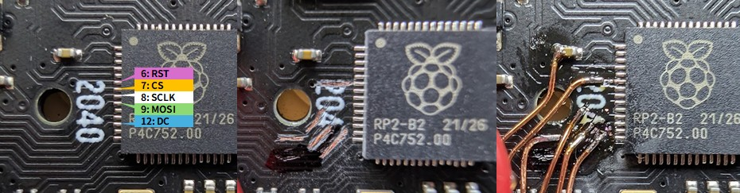

# Configuration for PicoSystem

## Using [LcdTap-Pico2 Universal](example/pico2_universal/README.md)

### External Deserializer is Required

The PicoSystem's SPI is too fast for the LcdTap's 4-Line SPI interface, so an [external deserializer](example/pico2_universal/README.md#external-deserializer-for-high-speed-spi) is required.

### Connection

To access the SPI bus on PicoSystem, you need to scrape off the solder resist on the board and solder the wires.

### Configuration

1. Load preset for ST7789.
2. Set Interface to 8-bit Parallel.
3. Set LCD size to 240x240.
4. Set Output Rotation to 0°.
