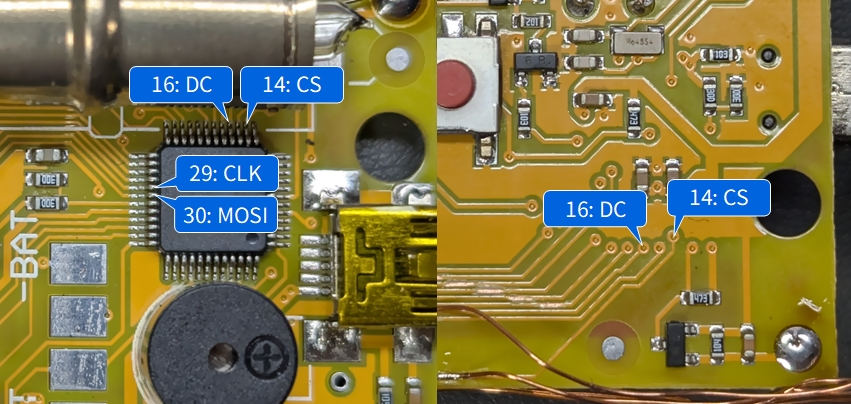

# Configuration for SOEKS-01M

> [!CAUTION]
> High voltage is present near the Geiger-Müller tube. Always turn off the power before working on it.

## Using [LcdTap-Pico2 Universal](example/pico2_universal/README.md)

### Connection

|LcdTap (Pico2)|Connection|
|:--|:--|
|GND|SOEKS-01M GND|
|GPIO0 (RST)|Open or 3V3|
|GPIO1 (CS)|SOEKS-01M CS (Pin 14)|
|GPIO2 (SCLK)|SOEKS-01M SCLK (Pin 29)|
|GPIO3 (MOSI)|SOEKS-01M MOSI (Pin 30)|
|GPIO4 (DC)|SOEKS-01M DC (Pin 16)|

### Configuration

1. Load preset for ST7789.
2. Set resolution to 128x160.
3. Set Format Override to RGB666_LA.
4. Set Output Rotation to 0°.