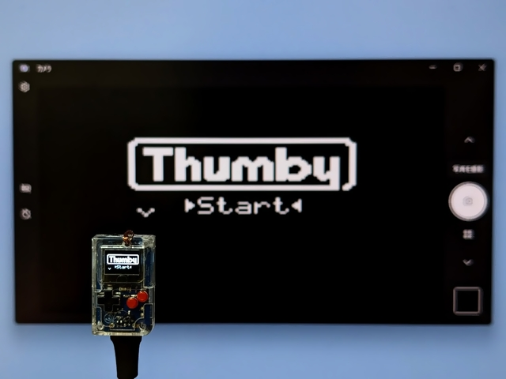
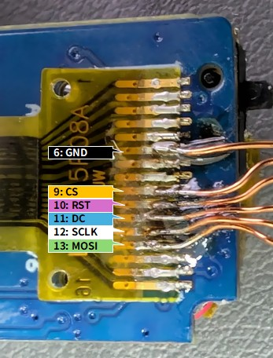

# Configuration for Thumby

## Using [LcdTap-Pico2 Universal](../../example/pico2_universal/)

### Connection

|LcdTap (Pico2)|Connection|
|:--|:--|
|GND|Thumby's GND|
|GPIO0 (RST)|Thumby's RST|
|GPIO1 (CS)|Thumby's CS|
|GPIO2 (SCLK)|Thumby's SCLK|
|GPIO3 (MOSI)|Thumby's MOSI|
|GPIO4 (DC)|Thumby's DC|

### Configuration

1. Load preset for SSD1306.
2. Change the interface type to SPI.

## Using [LcdTap-Pico2 for SSD1306](../../example/pico2_ssd1306/)

### Connection

|LcdTap (Pico2)|Connection|
|:--|:--|
|GND|Thumby's GND|
|GPIO0 (RST)|Thumby's RST|
|GPIO1 (CS)|Thumby's CS|
|GPIO2 (SCLK)|Thumby's SCLK|
|GPIO3 (MOSI)|Thumby's MOSI|
|GPIO4 (DC)|Thumby's DC|
|GPIO20 (CFG_OUT_720P)|Select according to your display|
|GPIO21 (CFG_LCD_SIZE_SEL)|Open or 3V3 (128x64)| 
|GPIO22 (CFG_IFACE_SEL)|GND (SPI)|
|GPIO27 (CFG_ROT\[0\])|Open or 3V3|
|GPIO28 (CFG_ROT\[1\])|GND (Rotate 180°)|
