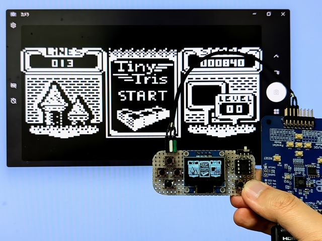

# Configuration for TinyJoyPad

See also: [LcdTap: TinyJoyPad や Arduboy を大画面で遊ぶ](https://blog.shapoco.net/2026/0514-tinyjoypad-with-large-monitor/)

## Using [LcdTap-Pico2 Universal](example/pico2_universal/README.md)

### Connection

|LcdTap (Pico2)|Connection|
|:--|:--|
|GND|TinyJoyPad's GND|
|GPIO8 (SDA)|TinyJoyPad's SDA|
|GPIO9 (SCL)|TinyJoyPad's SCL|

### Configuration

Use preset configuration for SSD1306.

## Using [LcdTap-Pico2 for SSD1306](example/pico2_ssd1306/README.md)

### Connection

|LcdTap (Pico2)|Connection|
|:--|:--|
|GND|TinyJoyPad's GND|
|GPIO8 (SDA)|TinyJoyPad's SDA|
|GPIO9 (SCL)|TinyJoyPad's SCL|
|GPIO20 (CFG_OUT_720P)|Select according to your display|
|GPIO21 (CFG_LCD_SIZE_SEL)|Open or 3V3 (128x64)| 
|GPIO22 (CFG_IFACE_SEL)|Open or 3V3 (I2C)|
|GPIO27/28 (CFG_ROT\[1:0\])|binary rotary switch or DIP-switch|

